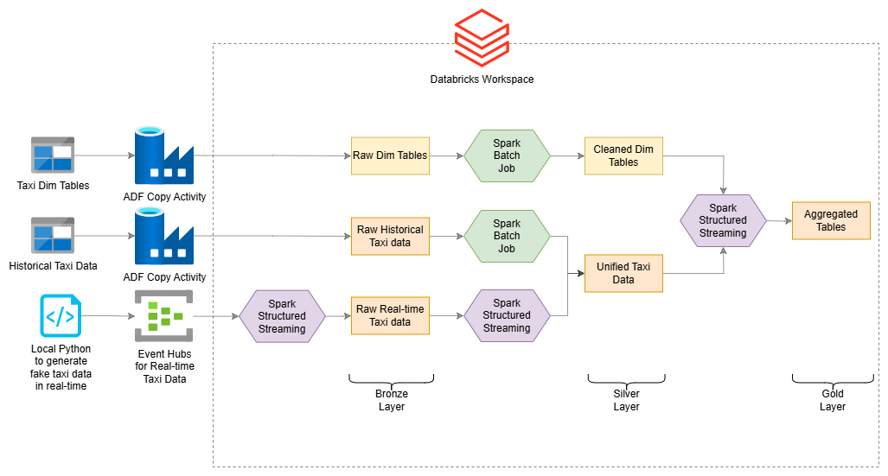
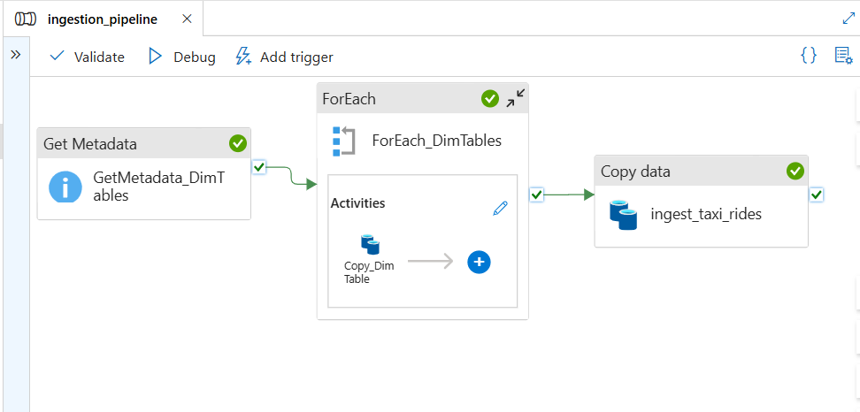
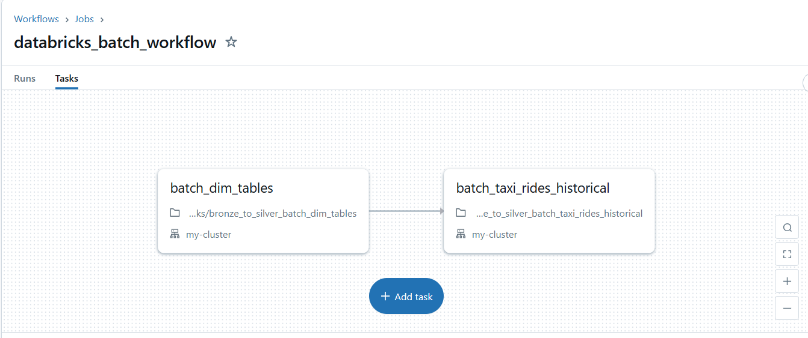
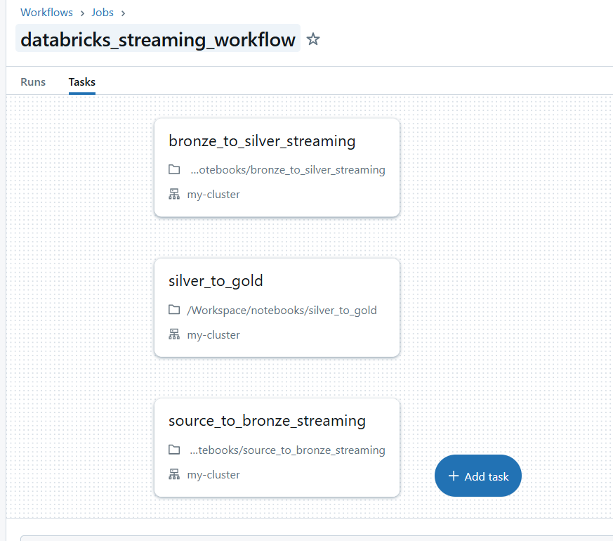
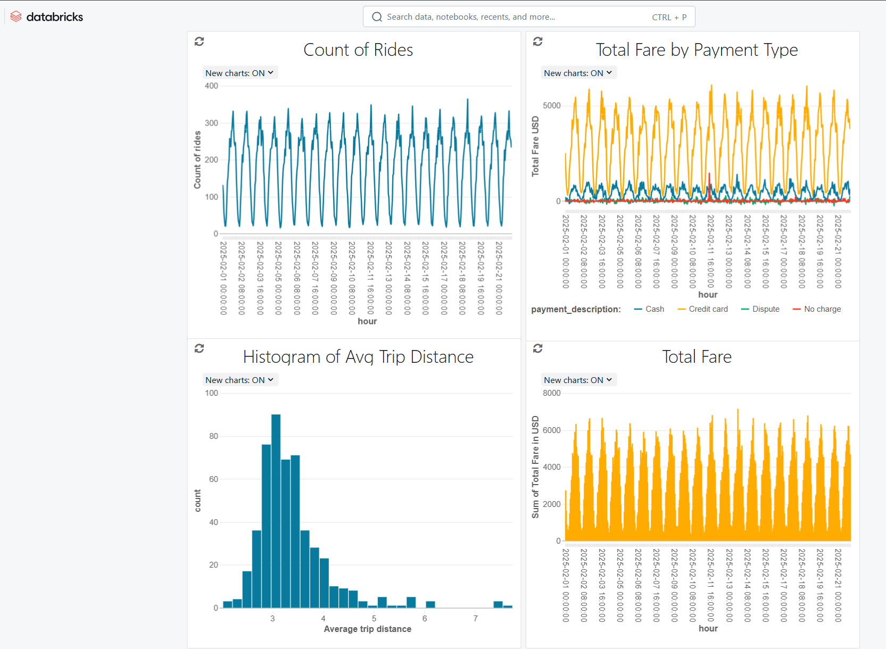
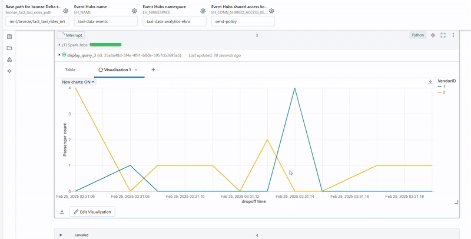
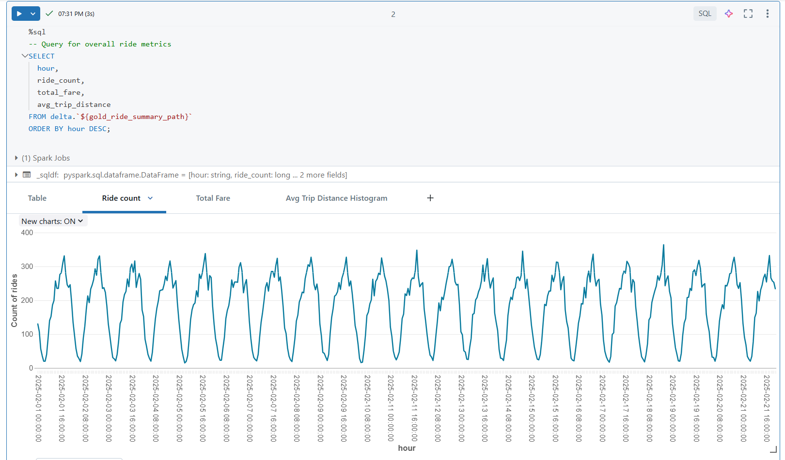
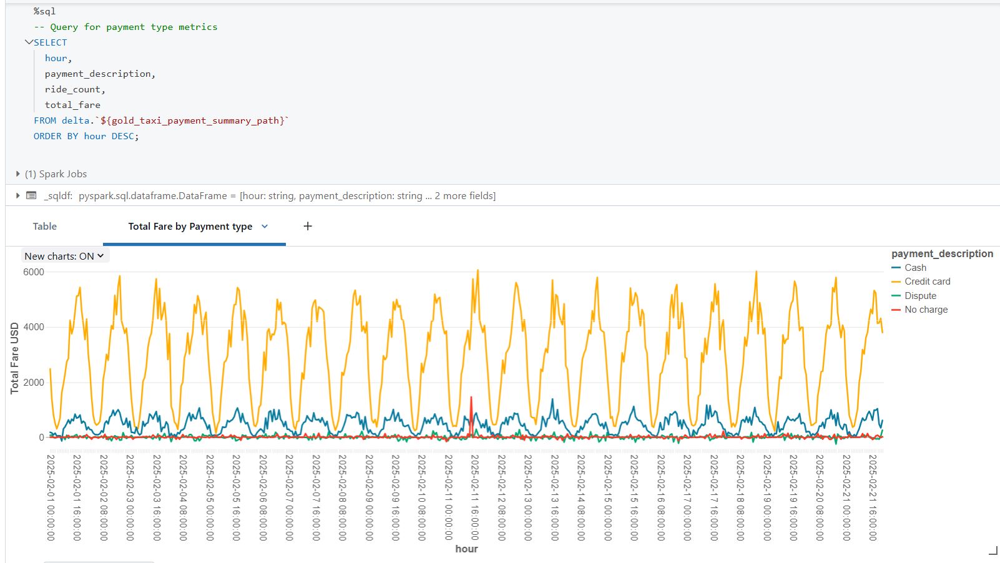

# Real-Time Taxi Data Analytics using Azure (ADF), Databrick and Terraform

## Overview

This project simulates and analyzes New York City taxi trip data using modern data engineering practices on Azure. The solution ingests both historical and real-time taxi data, processes it across Bronze, Silver, and Gold layers in Databricks, and orchestrates end-to-end workflows using Azure Data Factory and Terraform.

The overall architecture leverages Azure Blob Storage as a source data store, where historical taxi records and dimension tables are stored. The pipelines then process and enrich the data, ultimately providing aggregated insights through interactive dashboards.



## Data Sources

- **Historical Taxi Data**  
  The original historical taxi trip data was downloaded from the [NYC TLC Trip Record Data](https://www.nyc.gov/site/tlc/about/tlc-trip-record-data.page) site. Since the latest available dataset was for December 2024, fake historical data for 2025 was generated by sampling and modifying the original data.  
  - See the data generation script: [src/generate_historical_taxi_data.py](src/generate_historical_taxi_data.py)

- **Dimension Tables**  
  Dimension tables for payment types, rate codes, and taxi zones were also downloaded from the same NYC TLC website. These tables are used to enrich both the historical and real-time taxi data for better analytics.

Both the generated fake historical data and the dimension tables are loaded into Azure Blob Storage to mimic a production-grade source data storage.

## Environment Configuration

A `.env` file is used to configure environment variables for Azure deployments. An example of the file's contents is:

```dotenv
ARM_CLIENT_ID=
ARM_CLIENT_SECRET=
ARM_SUBSCRIPTION_ID=
ARM_TENANT_ID=
```

## Infrastructure & Data Pipeline Components

- **Azure Blob Storage**  
  Used as the source data store for both historical taxi records and dimension tables.

- **Azure Data Factory (ADF)**  
  Orchestrates data ingestion and transformation processes.  
  - A screenshot of the ADF pipeline is available here: 
    

- **Databricks Workflows**  
  Both batch and streaming pipelines are implemented in Databricks. Key workflows include:  
  - Batch processing of dimension tables:
    
  - Streaming ingestion workflows:
    
  - Interactive dashboards for analytics:
  

- **Terraform Scripts**  
  All infrastructure components are provisioned using Terraform. The Terraform configuration files are located under the `terraform/` directory.


# Project Structure and Key Modules

## Directory Structure

```plaintext
├── data/
│   ├── data_dictionary_trip_records_yellow.pdf
│   ├── yellow_tripdata_2024-11.csv
│   └── dim_tables/
│       ├── dim_payment_type.csv
│       ├── dim_rate_codes.csv
│       └── dim_zone.csv
├── Misc/
│   └── Diagram.drawio
├── notebooks/
│   ├── bronze_to_silver_batch_dim_tables.py
│   ├── bronze_to_silver_batch_taxi_rides_historical.py
│   ├── bronze_to_silver_streaming.py
│   ├── dashboard.py
│   ├── silver_to_gold.py
│   └── source_to_bronze_streaming.py
├── screenshots/
│   ├── adf_pipiline_screenshot.png
│   ├── databricks_batch_workflow.png
│   ├── databricks_dashboard.png
│   ├── databricks_streaming_workflow.png
│   ├── data_architecture_diagram.png
│   ├── real-time-passenger-count-by-vendor.gif
│   ├── ride_count_plot.png
│   └── total_fare_by_payment_type_plot.png
├── src/
│   ├── generate_historical_taxi_data.py
│   ├── generate_real_time_taxi_data.py
│   ├── parquet_to_csv.py
│   └── taxi_eventhub_connection_string.txt
└── terraform/
    ├── .terraform.lock.hcl
    ├── adf.tf
    ├── databricks.tf
    ├── event_hubs.tf
    ├── main.tf
    ├── terraform.tfstate
    ├── terraform.tfstate.backup
    └── variables.tf
```

## File & Module Descriptions

### Data Directory

- **[data/data_dictionary_trip_records_yellow.pdf](data/data_dictionary_trip_records_yellow.pdf)**  
  Provides the data dictionary for the yellow taxi trip records.

- **[data/yellow_tripdata_2024-11.csv](data/yellow_tripdata_2024-11.csv)**  
  Contains historical taxi trip data for November 2024, which is used as the baseline for generating fake historical data.

- **data/dim_tables/**  
  Contains CSV files for dimension tables:
  - **[data/dim_tables/dim_payment_type.csv](data/dim_tables/dim_payment_type.csv)** – Payment type information.
  - **[data/dim_tables/dim_rate_codes.csv](data/dim_tables/dim_rate_codes.csv)** – Rate code details.
  - **[data/dim_tables/dim_zone.csv](data/dim_tables/dim_zone.csv)** – Taxi zones information.

### Misc Directory

- **[Misc/Diagram.drawio](Misc/Diagram.drawio)**  
  Source file for the system and data architecture diagram.


### Notebooks Directory

This folder contains Databricks notebooks that manage the end-to-end ETL workflows.

- **[notebooks/bronze_to_silver_batch_dim_tables.py](notebooks/bronze_to_silver_batch_dim_tables.py)**  
  Reads dimension tables from the Bronze layer, performs data cleaning, and writes the cleaned data to the Silver layer.

- **[notebooks/bronze_to_silver_batch_taxi_rides_historical.py](notebooks/bronze_to_silver_batch_taxi_rides_historical.py)**  
  Processes historical taxi ride data from the Bronze Delta table, transforms it, and loads it into the Silver Delta table in batch mode.

- **[notebooks/bronze_to_silver_streaming.py](notebooks/bronze_to_silver_streaming.py)**  
  Handles streaming data ingestion, processing data from the Bronze layer, and writes it to the Silver layer in near real-time.

- **[notebooks/dashboard.py](notebooks/dashboard.py)**  
  Contains SQL queries and visualization logic for building interactive dashboards for taxi ride metrics.

- **[notebooks/silver_to_gold.py](notebooks/silver_to_gold.py)**  
  Aggregates enriched taxi ride data from the Silver layer to create Gold tables, providing summarized analytics such as ride counts and fare totals.

- **[notebooks/source_to_bronze_streaming.py](notebooks/source_to_bronze_streaming.py)**  
  Reads real-time taxi event data from Azure Event Hubs, processes it, and writes to the Bronze Delta table.

### Screenshots Directory

This folder hosts various visual assets that illustrate the project architecture and workflows.

### Source Directory

Contains Python scripts for data simulation, transformation, and event generation.

- **[src/generate_historical_taxi_data.py](src/generate_historical_taxi_data.py)**  
  Generates fake historical taxi data for 2025 by sampling and modifying the November 2024 data.

- **[src/generate_real_time_taxi_data.py](src/generate_real_time_taxi_data.py)**  
  Simulates real-time taxi events by sampling historical data, adjusting timestamps, and sending events to Azure Event Hubs.

- **[src/parquet_to_csv.py](src/parquet_to_csv.py)**  
  A utility script for converting Parquet files to CSV format.

- **[src/taxi_eventhub_connection_string.txt](src/taxi_eventhub_connection_string.txt)**  
  Contains the Azure Event Hub connection string used by the real-time event generation script.

### Terraform Directory

Holds all Terraform configuration files for deploying and managing Azure resources.

- **[terraform/adf.tf](terraform/adf.tf)**  
  Defines Azure Data Factory and its linked services.

- **[terraform/databricks.tf](terraform/databricks.tf)**  
  Provisions the Azure Databricks workspace, clusters, and uploads notebooks for executing ETL workflows.

- **[terraform/event_hubs.tf](terraform/event_hubs.tf)**  
  Configures Azure Event Hubs and associated authorization rules.

- **[terraform/main.tf](terraform/main.tf)**  
  Main configuration file for resource group, storage accounts, and high-level settings.

- **[terraform/variables.tf](terraform/variables.tf)**  
  Contains variable definitions used across the Terraform scripts.

- Additional state files (e.g., `terraform.tfstate`, `terraform.tfstate.backup`, and `.terraform.lock.hcl`) are maintained for Terraform state management.

## Key Modules & Workflows

### Data Ingestion & Processing

- **Batch Processing:**  
  The batch processing notebooks ([bronze_to_silver_batch_dim_tables.py](notebooks/bronze_to_silver_batch_dim_tables.py) and [bronze_to_silver_batch_taxi_rides_historical.py](notebooks/bronze_to_silver_batch_taxi_rides_historical.py)) ingest and transform historical taxi ride data and dimension tables from the Bronze layer to the Silver layer.

- **Streaming Processing:**  
  Real-time data ingestion is managed by the streaming notebooks ([source_to_bronze_streaming.py](notebooks/source_to_bronze_streaming.py) and [bronze_to_silver_streaming.py](notebooks/bronze_to_silver_streaming.py)), which process live data from Azure Event Hubs and update the Silver layer accordingly.

  **Real-time data streaming - Passenger Count by Vendor ID :**

  

- **Aggregation & Analytics:**  
  The [silver_to_gold.py](notebooks/silver_to_gold.py) notebook aggregates data to form Gold tables that support analytics, while [dashboard.py](notebooks/dashboard.py) facilitates interactive querying and visualization.

  **Example plot showing ride count trends:**

  

  **Visualization of total fare breakdown by payment type:**

  

### Data Generation & Simulation

- **Historical Data Generation:**  
  The script [generate_historical_taxi_data.py](src/generate_historical_taxi_data.py) creates synthetic 2025 taxi data by sampling the 2024 data and adjusting timestamps.

- **Real-Time Event Simulation:**  
  Real-time event simulation is performed by [generate_real_time_taxi_data.py](src/generate_real_time_taxi_data.py), which sends updated taxi events to Azure Event Hubs for ingestion.

# Setup, Deployment, and Usage

## Prerequisites

- **Azure Account:** Ensure you have access to an Azure subscription.
- **Databricks Workspace:** An Azure Databricks workspace is required to run the notebooks.
- **Terraform:** Install Terraform (v0.14 or later) to deploy infrastructure.
- **Python 3.8+:** Make sure Python is installed along with required libraries (e.g., pandas, numpy, azure-eventhub).
- **.env File:** Create a `.env` file with your Azure credentials

## Environment Setup

1. **Clone the Repository:**  
   Clone the project repository to your local machine.

2. **Python Environment:**  
   Set up a virtual environment and install the dependencies:
   ```bash
   python -m venv venv
   source venv/bin/activate   
   
   # On Windows use: venv\Scripts\activate
   
   pip install -r requirements.txt
   ```
   *(Ensure that your `requirements.txt` includes necessary packages such as `pandas`, `numpy`, and `azure-eventhub`.)*

3. **Configure Environment Variables:**  
   Create a `.env` file at the root of the project with your Azure credentials:
   ```dotenv
   ARM_CLIENT_ID=your_client_id
   ARM_CLIENT_SECRET=your_client_secret
   ARM_SUBSCRIPTION_ID=your_subscription_id
   ARM_TENANT_ID=your_tenant_id
   ```

## Infrastructure Deployment with Terraform

1. **Initialize Terraform:**  
   Navigate to the `terraform/` directory and initialize Terraform:
   ```bash
   cd terraform
   terraform init
   ```

2. **Plan Deployment:**  
   Review the planned changes:
   ```bash
   terraform plan
   ```

3. **Apply Deployment:**  
   Deploy all resources (resource group, storage accounts, Data Factory, Databricks workspace, Event Hubs, etc.):
   ```bash
   terraform apply
   ```
   Confirm the execution when prompted.

4. **Verify Resources:**  
   Once deployment is complete, verify the resources in the [Azure Portal](https://portal.azure.com).

## Databricks Setup

- **Notebooks Deployment:**  
  The Terraform configuration automatically uploads the notebooks located in the `notebooks/` directory to the Databricks workspace. You can also manually import notebooks if needed.
  - Example notebook: [notebooks/bronze_to_silver_batch_dim_tables.py](notebooks/bronze_to_silver_batch_dim_tables.py)

- **Cluster Configuration:**  
  The Terraform scripts provision a Databricks cluster. Ensure the cluster is running before triggering any jobs.

## Data Generation and Simulation

1. **Generate Historical Data:**  
   Run the historical data generation script to create fake 2025 taxi data:
   ```bash
   python src/generate_historical_taxi_data.py --input-file data/yellow_tripdata_2024-11.csv --start-date 2025-02-01 --end-date 2025-02-24 --rows-per-day 5000
   ```
   The output CSV will be saved (by default) under a path like:
   ```
   data/generated_historical_taxi_data/yellow_tripdata_2025-02-01_to_2025-02-24.csv
   ```

2. **Simulate Real-Time Data:**  
   To simulate real-time taxi events, run:
   ```bash
   python src/generate_real_time_taxi_data.py --input-file data/yellow_tripdata_2024-11.csv --interval 1 --conn-str-file src/taxi_eventhub_connection_string.txt
   ```
   This script continuously sends events to Azure Event Hubs. Ensure the connection string file exists at [src/taxi_eventhub_connection_string.txt](src/taxi_eventhub_connection_string.txt).

## Running the ETL Pipelines

- **Batch Processing:**  
  - Launch the batch processing notebooks in Databricks:
    - [bronze_to_silver_batch_dim_tables.py](notebooks/bronze_to_silver_batch_dim_tables.py)
    - [bronze_to_silver_batch_taxi_rides_historical.py](notebooks/bronze_to_silver_batch_taxi_rides_historical.py)

- **Streaming Processing:**  
  - Start the streaming pipelines by executing:
    - [source_to_bronze_streaming.py](notebooks/source_to_bronze_streaming.py)
    - [bronze_to_silver_streaming.py](notebooks/bronze_to_silver_streaming.py)

- **Aggregation and Analytics:**  
  - Run the [silver_to_gold.py](notebooks/silver_to_gold.py) notebook to aggregate data from the Silver layer into Gold tables.
  - Access analytical dashboards using the [dashboard.py](notebooks/dashboard.py) notebook.

## Monitoring & Troubleshooting

- **Logging:**  
  Monitor logs in the Databricks job interface and Azure Monitor to troubleshoot issues with batch or streaming pipelines.

- **Dashboard:**  
  The dashboard notebook ([dashboard.py](notebooks/dashboard.py)) provides SQL queries for interactive analytics. Use it to validate the aggregated results from Gold tables.

## Cleanup

- **Terraform Destroy:**  
  To remove all deployed resources and avoid ongoing charges, run:
  ```bash
  terraform destroy
  ```
  **Note:** Ensure you have backed up any critical data before destroying resources.

## Contributing and Support

Contributions and feedback are welcome. Please open an issue or submit a pull request for improvements or bug fixes.